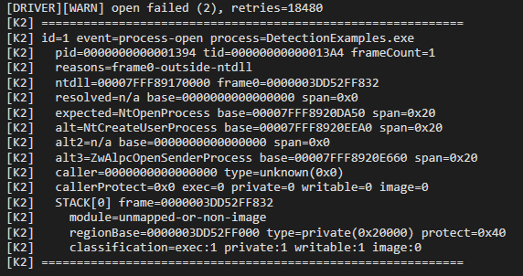

# K2



`K2` is a PoC for detecting direct-syscalls executed by frameworks such as SysWhispers (and children), HellsGate and frameworks using similar TTP's.

## SUMMARY

The driver registers callbacks;

- process creation
- thread creation
- process handle opens / duplicates
- thread handle opens / duplicates

When one of those events fires, `K2` walks the current user stack and checks:

- whether the top user frame resolves into the real mapped `ntdll.dll`
- whether the frame is inside the expected `Nt*` export set for that callback
- whether the frame lands in a different `Nt*` export 
- whether the caller frame comes from executable private memory, writable+executable memory, or other non-image executable regions

For object-handle callbacks that means allowing the legitimate creator syscalls as well. For example, a thread handle create can naturally arrive from `NtOpenThread`, `NtCreateThreadEx`, `NtCreateUserProcess`, or `ZwAlpcOpenSenderThread`, and a process handle create can legitimately come from `NtOpenProcess`, `NtCreateUserProcess`, or `ZwAlpcOpenSenderProcess`. Treating every non-`NtOpen*` path as malicious creates noise from normal WMI, CLR, CSRSS, CTF, and other Windows activity.

The detections are logged to the kernel debugger and can be inspected in WinDbg (Didn't feel like implementing an IOCTL pane for a PoC).

## WHY?

A lot of offensive syscall tooling still seems to think direct-syscalls are some magical bypass, executing `syscall` directly magically bypasses usermode hooks...

Which yes, it does. But, the kernel?

`SysWhispers`, `Hell's Gate`, and their endless descendants are useful examples of how operators try to bypass user-mode hooks, which work but cause even more detections from within the kernel:

- the syscall path does not begin in the expected `ntdll` stub

Even in more advanced implementations, where the callstack is spoofed into `ntdll`;

- the stack points at a different `Nt*` export than the one being exercised

Or, in the case the tool gets the export correct, if its hooked the operator executes your hook anyway, and if they patch it any sufficient EDR should pick up on that instantly.

## BUILD

From this directory:

```bat
msbuild K2.vcxproj /t:Build /p:Configuration=Debug /p:Platform=x64 /p:SignMode=Off
```

The project-side WDK signing path is not reliable on this box, so the practical path is:

```bat
set K2_PFX_PASSWORD=your-pfx-password
installer.bat
```

or:

```bat
installer.bat your-pfx-password
```

The installer will sign `K2.sys` with the local `.pfx` before staging it into `System32\drivers`.

## INSTALL & REMOVE

Put `K2.sys` in this same directory as the scripts, then run as admin:

```bat
installer.bat
```

To remove it:

```bat
remover.bat
```

The installer copies `K2.sys` into `C:\Windows\System32\drivers\K2.sys`, creates or updates the `K2` kernel service to point there, and starts it. The remover stops and deletes the service, then removes the staged driver file.

## WINDBG

Filter on the `K2` prefix:

```text
[K2] ============================================================
[K2] id=... event=... process=...
[K2]   pid=... tid=... frameCount=...
[K2]   reasons=...
[K2]   ntdll=... frame0=...
[K2]   resolved=... base=... span=...
[K2]   expected=... base=... span=...
[K2]   alt=... base=... span=...
[K2]   alt2=... base=... span=...
[K2]   alt3=... base=... span=...
[K2]   caller=... type=...
[K2]   callerProtect=... exec=... private=... writable=... image=...
[K2]   STACK[0] frame=...
[K2]     module=... or module=unmapped-or-non-image
[K2]     regionBase=... type=... protect=...
[K2]     classification=exec:... private:... writable:... image:...
[K2]     export=...
[K2] ============================================================
```
